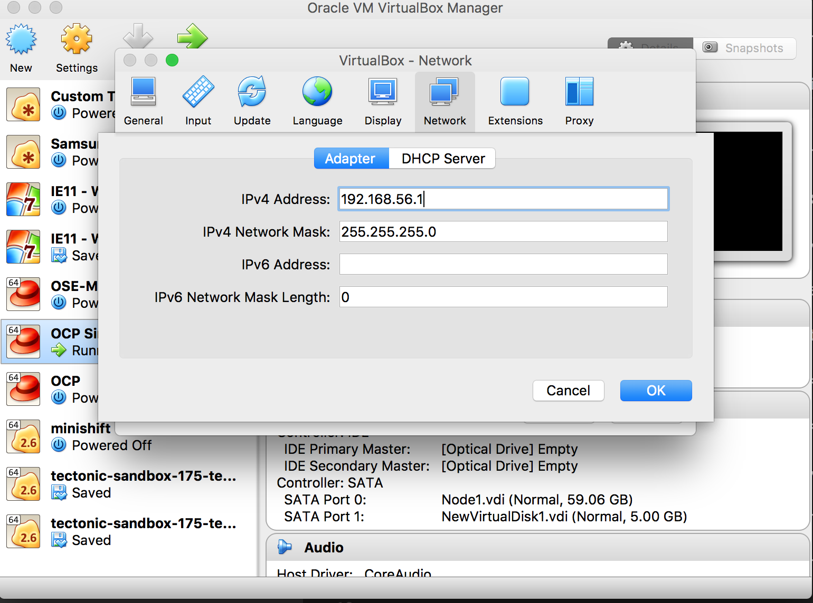
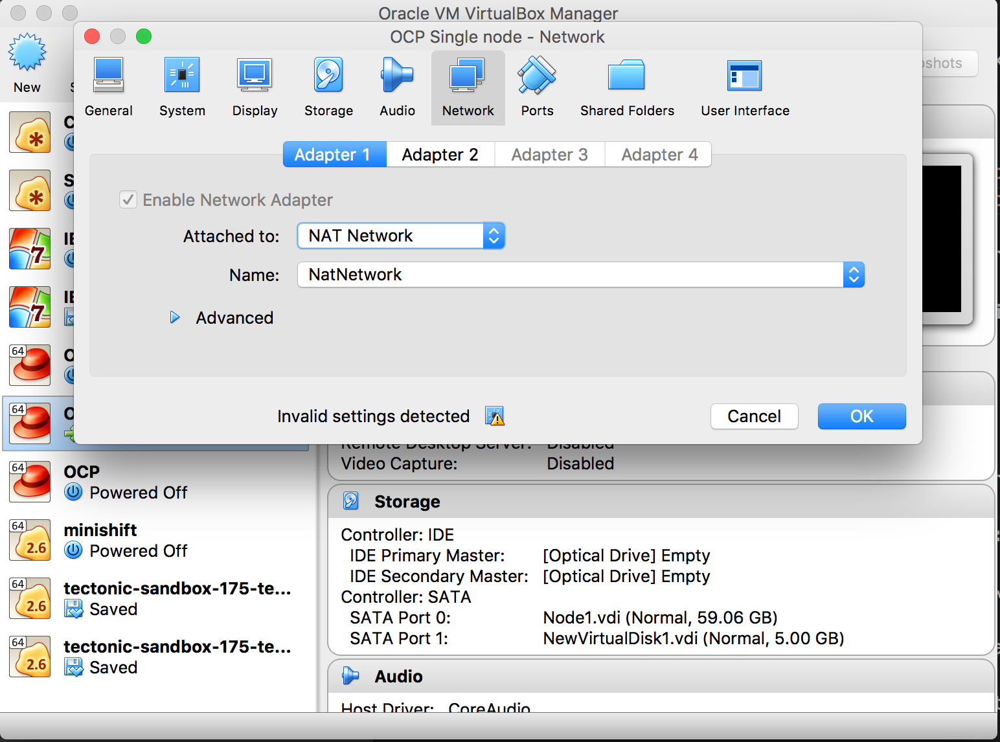
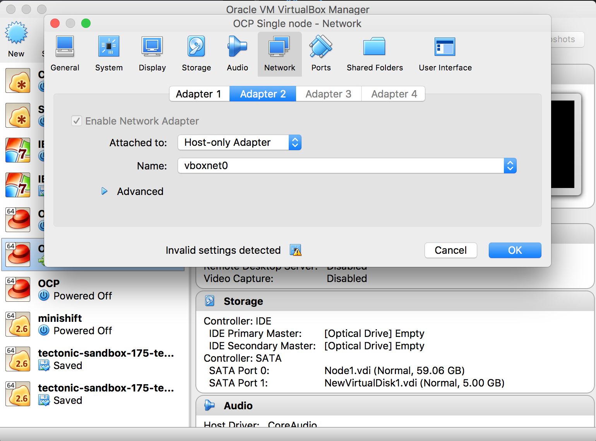
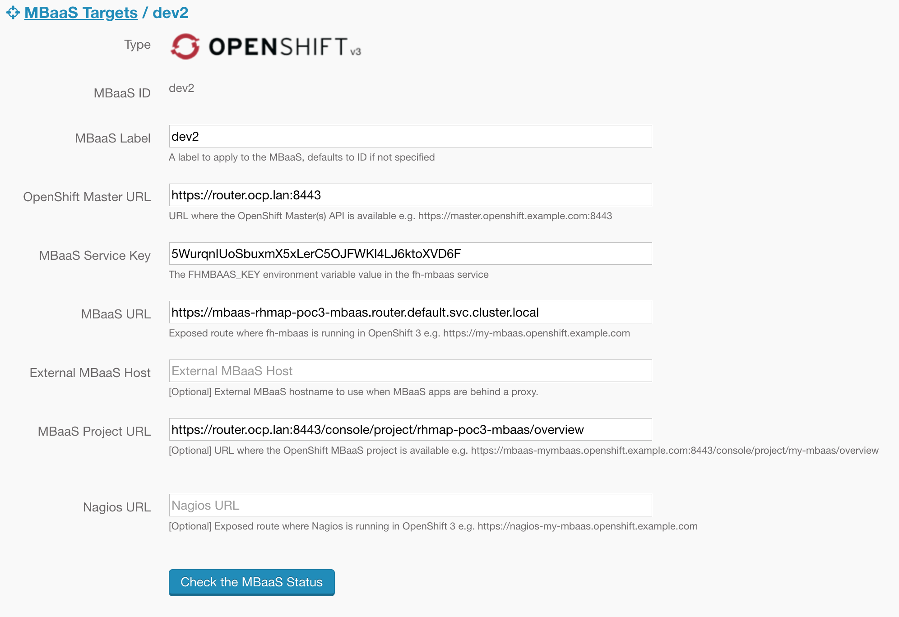

# RHMAP Local Install
## Overview
The following guide details installation procedures via Ansible for RHMAP (Core and MBaaS) for a local OCP cluster running in Virtualbox.
These scripts install Core without UPS, as the UPS Pod was failing to start correctly.
These scripts also reduce the CPU resources required to allow all PODs to run on a single VM.

## Prerequisites
1. A local installation of OCP running on RHEL in Virtualbox.  With two network controllers, NAT and host only
2. Guest OS should have 4 CPUs, 8Gb memory, and 60Gb storage
3. ssh access to the RHEL VM from the host e.g. ssh root@ocphost without password prompt
4. Edit the node config file to increase the number of allowed pods by editing /etc/origin/node/node-config.yaml.  Under kubeletArguments add max-pods as shown below:
```
kubeletArguments:
  max-pods:
    - "40"
```
5. Restart the node with:
```
systemctl restart atomic-openshift-node
```

6. Guest OS should be registered with subscription-manager and attached to the correct Pool for RHMAP.
```
subscription-manager list --available
```
Find the pool_id for RHMAP subscription:
```
sudo subscription-manager attach --pool=<pool_id>
```

7. The node should be labelled with type=core
```
oc label node core-1 type=core
```

## Network setup and PV configuration
Setup a host only network on on your virtualbox guest to host.


Configure the vm to use the host only network and NAT network



Create NFS shares on your Virtual box host.  In OSX edit /etc/exports and list the following exports:
Where username is your username and ip-subnet is the subnet of the Virtualbox host only adapter e.g 192.168.56.0


```
/Users/<username>/testnfs/32gb -maproot=root:wheel -network <ip-subnet> -mask 255.255.255.0
/Users/<username>/testnfs/nagios -maproot=root:wheel -network <ip-subnet> -mask 255.255.255.0
/Users/<username>/testnfs/mySql -maproot=root:wheel -network <ip-subnet> -mask 255.255.255.0
/Users/<username>/testnfs/mongoDb_replica_1 -maproot=root:wheel -network <ip-subnet> -mask 255.255.255.0
/Users/<username>/testnfs/mongoDb -maproot=root:wheel -network <ip-subnet> -mask 255.255.255.0
/Users/<username>/testnfs/metricsData -maproot=root:wheel -network <ip-subnet> -mask 255.255.255.0
/Users/<username>/testnfs/gitLabShell -maproot=root:wheel -network <ip-subnet> -mask 255.255.255.0
/Users/<username>/testnfs/FHSCM -maproot=root:wheel -network <ip-subnet> -mask 255.255.255.0
/Users/<username>/testnfs/1gb1 -maproot=root:wheel -network <ip-subnet> -mask 255.255.255.0
/Users/<username>/testnfs/1gb2 -maproot=root:wheel -network <ip-subnet> -mask 255.255.255.0 
```

Restart the nfs service on the host: 
``` 
sudo nfsd restart 
```

Edit the PV defitions in RHMAP-PV/RHMAP to reflect the correct locations of the nfs shares from the virtualbox host.  The path and server fields will need to be edited.


## Installation
1. Change into the rhmap-installer folder and modify poc-inventory.yml with the correct hostname of your OCP instance
2. Execute the following which ensures required files are copied to required servers.
    ```
    ansible-playbook -i ./poc-inventory.yml playbooks/copyRequiredFiles.yml
    ```
3. Create Persistant volumes.
      ```
      ansible-playbook -i poc-inventory.yml playbooks/createPVs.yml
      ```
      **Note:** This creates PVs for both Core and MBaaS installations.
      
4. Kick off the install for RHMAP core with the following command: 
    ```
    ansible-playbook -i ./poc-inventory.yml playbooks/poc.yml --extra-vars "core_templates_dir=/root/templates/core mbaas_templates_dir=/root/templates/mbaas" --skip-tags=rpm
    ```
5. Install complete
    * The install will take approximately 15 minutes.  

6. Final steps
    * From the OCP vm shell run the following command to get the url of RHMAP Core
    ```
    oc project rhmap-poc-core
    oc get route rhmap --template "https://{{.spec.host}}"
    ```
    * To get the administrator login details, from osmaster1 run:
    ```
    oc env dc/millicore --list | grep FH_ADMIN
    ```


4. Create MBaaS target:


## Tear Down
1. Delete the projects
From the OCP vm shell enter the following:
    ```
    oc delete project rhmap-poc-core
    oc delete project rhmap-poc-mbaas
    oc delete project <<environment project name>>
    ```

2. Delete the PVs
    ```
    ansible-playbook -i poc-inventory.yml playbooks/deletePVs.yml
    ```

3. Clear the NFS shares
    ```
    ansible-playbook -i poc-inventory.yml playbooks/clearNFSShares.yml
    ```